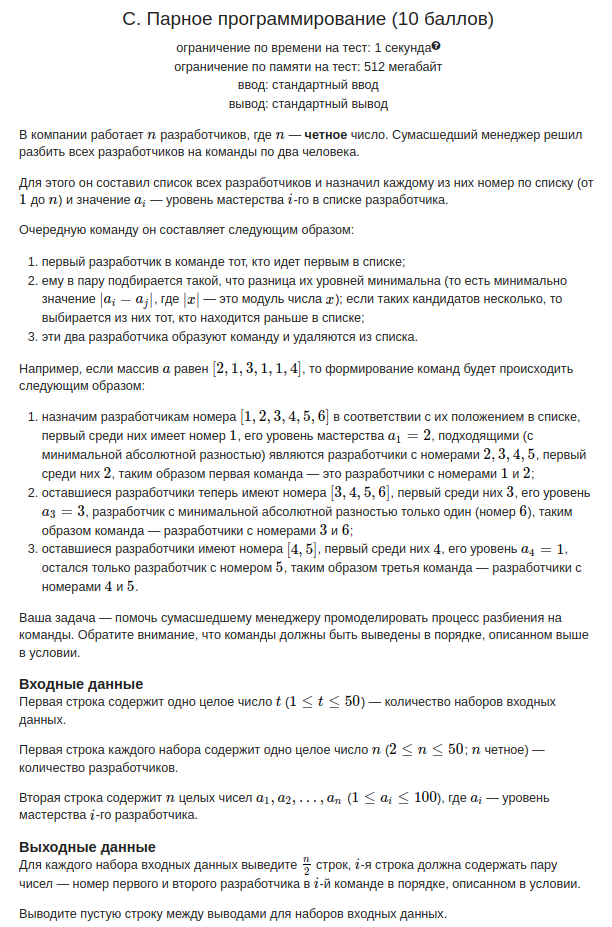

Пример

входные данные

```
5
256 42
1000 1000
-1000 1000
-1000 1000
20 22
```

выходные данныеСкопировать

```
298
2000
0
0
42
```


входные данные

```
6
12
2 2 2 2 2 2 2 3 3 3 3 3
12
2 3 2 3 2 2 3 2 3 2 2 3
1
10000
9
1 2 3 1 2 3 1 2 3
6
10000 10000 10000 10000 10000 10000
6
300 100 200 300 200 300
```

выходные данные

```
22
22
10000
12
40000
1100
```



входные данные

```
3
6
2 1 3 1 1 4
2
5 5
8
1 4 2 5 4 2 6 3
```

выходные данные

```
1 2
3 6
4 5

1 2

1 3
2 5
4 7
6 8
```
